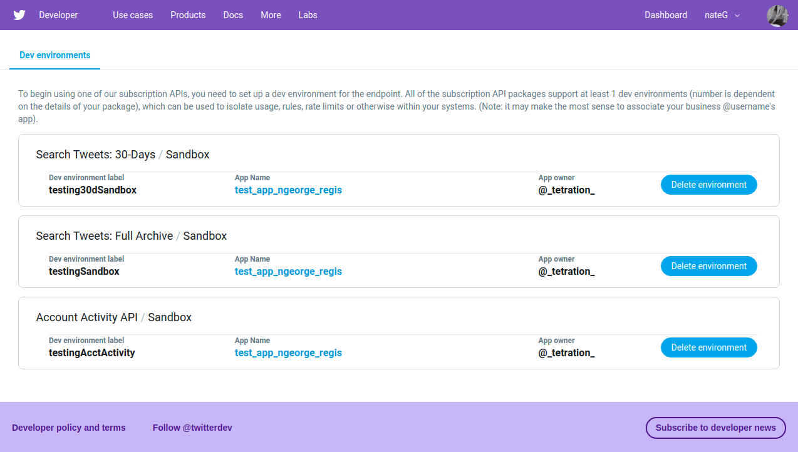

# Twitter Premium Search Example
Twitter has an API for searching historical tweets, deemed 'premium'.  This allows search back to the very first tweet in 2006.  Unfortunately, the documentation is large and unwieldy.  This repo shows an example of using Python with the [search-tweets-python](https://github.com/twitterdev/search-tweets-python) package to use Twitter's premium API.

# Steps
## 1. Get API keys
First you need to go to [Twitter's developer portal](https://developer.twitter.com/en) and apply for an API key by creating an app.  The app creation page is under your username -> apps (on the upper right) or [here](https://developer.twitter.com/en/apps).  This can take a while (weeks) to be approved.

## 2. Install search-tweets-python
`pip install search-tweets-python`

## 3. Set up configuration YAML file
There is a demo YAML file in this repo called `creds_template.yml`.  You will need to fill in this file with your API keys and desired endpoint.

The API keys are from your app you created.  Go to your apps, then choose the app you created, then choose 'Keys and tokens'.  The consumer key and secret are at the top of this page.  

The `endpoint` in the YAML file is the most confusing part.  This is a URL which you also add your dev environment name to.  For example, [here](https://developer.twitter.com/en/docs/tweets/search/quick-start/premium-30-day) are the docs for the 30-day search.  This shows the endpoint for 30-day search is "https://api.twitter.com/1.1/tweets/search/30day/<ENV>.json".  The <ENV> part means you should fill in your developer environment name.  This is found [here](https://developer.twitter.com/en/account/environments), which is under "your username -> Dev environments" from the developer dashboard.  For example, my dev environment label for 30-day search is called "testing30dSandbox" as you can see in the image below.



Below there is an example config YAML file.  The endpoint is the 30-day search with my 30-day search dev env label ("https://api.twitter.com/1.1/tweets/search/30day/testing30dSandbox.json").


```
test_app:
  account_type: premium
  endpoint: https://api.twitter.com/1.1/tweets/search/30day/testing30dSandbox.json
  consumer_key: CtvDUmaoeuaoeueuYeAaoeueouMIb
  consumer_secret: EipMuaoeueaoueoeuo9OsW9WzRZfLm2aoeueuoeucnd1aV
```


### Other endpoints
There is also a counts endpoint (not available to sandbox/demo users) and [full archive search](https://developer.twitter.com/en/docs/tweets/search/quick-start/premium-full-archive) endpoint (https://api.twitter.com/1.1/tweets/search/fullarchive/<ENV>.json).


## 4. Collect data
Now you should be able to run `test_search.py`.  You will need to make sure you have your YAML file set up and saved, and should ensure the `filename` argument in `load_credentials` is set correctly.